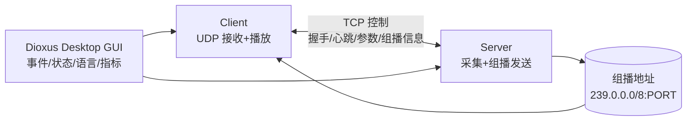
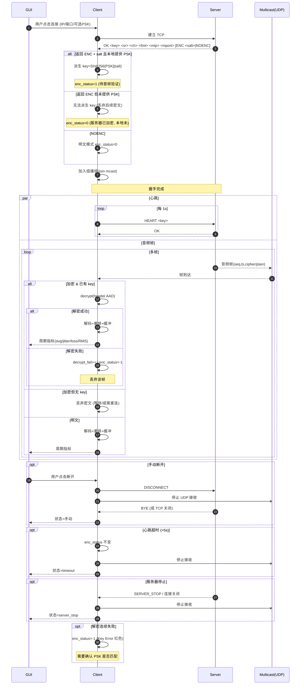

# 开发者文档

这是面向开发者的技术说明，终端用户说明参见项目根 `README.md`。

## 1. 顶层架构



## 2. 目录与模块
```
build.rs          # 编译期读取 lang/*.json 生成嵌入静态表 (lang_data.rs)
src/
	main.rs         # 入口：初始化语言、启动 GUI
	dioxus_gui.rs   # GUI 组件与状态管理、能力检测、窗口标题动态更新
	lang.rs         # 语言表解析/切换
	audio.rs        # CPAL 设备枚举、输入/输出流构建
	server.rs       # TCP 控制 + UDP 发送音频帧
	client.rs       # TCP 心跳 + UDP 接收 + 抖动缓冲 + 播放
	buffers.rs      # 可复用缓冲池
	types.rs        # 协议常量、格式码、魔术字
	net.rs          # 端口/本地地址辅助函数
assets/icon/*     # 应用图标 (icns/ico)
lang/*.json       # 原始多语言 JSON（编译期打包）
Info.plist        # macOS 权限描述 (麦克风/局域网)
Dioxus.toml       # Dioxus Desktop 打包配置
ATTRIBUTIONS.md   # 图标署名
```

### 2.1 语言系统
- `build.rs` 遍历 `lang/` 目录，读取所有 `*.json`。
- 生成 `lang_data.rs`，包含静态切片 `EMBEDDED_LANGS: &[(&'static str, &'static str)]`。
- 运行时 `lang.rs` 解析 JSON → HashMap 存入全局 `RwLock`。
- 切换语言仅替换当前语言代码 + 通知 GUI 重渲染；窗口标题通过 effect 重新设置。

## 3. 协议设计
### 3.1 控制 (TCP)
- 握手：Server 接入后发送：`OK <key> <sample_rate> <channels> <fmt_code> <mcast_ip> <mcast_port>`
	- 其中 `<mcast_ip>` 为服务器启动时在 `239.0.0.0/8` 内随机选择的组播地址。
	- `<mcast_port>` 当前等于控制端口。
- 心跳：客户端每 1s 发送 `HEART <key>`，服务器回 `OK`；超过 5s 未收到视为掉线。服务器亦会在内部表中剔除超时客户端。
- 断开：客户端发送 `DISCONNECT`；服务端停止后发送/或直接关闭连接触发 `SERVER_STOP` 逻辑。

### 3.2 音频帧 (UDP 组播)
服务器在启动时随机选择 `239.0.0.0/8` 内一个地址作为本会话组播地址（与控制端口组合形成 `<mcast_ip>:<port>`）。所有客户端握手后加入该组。帧头固定 22 字节：
```
magic(2) | seq(u32) | fmt(u8) | ch(u8) | rate(u32) | payload_len(u16) | ts_ns(u64)
```
字段说明：
- magic: 常量，用于快速丢弃噪声包。
- seq: 单调递增序列号（u32 → 本地扩展为 u64 统计）。
- fmt: 样本格式代码（见 `types.rs`）。
- ch / rate: 冗余携带参数，允许客户端后连时做一致性验证/热切换。
- payload_len: 后续有效载荷字节数。
- ts_ns: 服务器发送时的单调时钟纳秒数，用于对齐与延迟估算。

### 3.3 自适应抖动缓冲
客户端 `client.rs`：
1. 首帧建立 `base_server_ts` 与 `base_client_instant`。
2. 计算 transit = (arrival_rel - server_rel - offset)，对相邻差分 |d| 做 EWMA → jitter。
3. 由 jitter 推导：
	 - `reorder_delay`
	 - `target_buffer_ns`
	 - `max_buffer_ns`
4. 使用最小堆（按 ts_ns）做乱序重排，满足条件释放：
	 - 到达延迟满足重排窗口且已达到目标缓冲，或
	 - 缓冲溢出超过上限。
5. 迟到丢弃：`ts + 2*reorder_delay < newest_ts`。
6. 统计：平均延迟、抖动、丢包率（基于 seq gap）、迟到帧计数、RMS/峰值。

### 3.4 握手 / 加密 / 断开序列图


要点更新：
- 增加 ENC/NOENC 分支与 `enc_status` (0=明文/未派生, 1=成功, -1=失败)。
- 解密失败不回退为明文；连续失败保持 -1 状态。
- “加密但无 PSK” 情况：密文被安全丢弃，GUI 徽章灰/红提示（取决于服务器是否开启加密）。
- 心跳、音频帧并行；指标更新频率由客户端内部定时触发 (≈100ms)。
- 断开路径统一：停止 UDP 接收与播放线程后再通知 GUI。

## 4. 音频管线
Server:
```
CPAL Input Stream -> Buffer 打包 -> UDP 组播发送
```
Client:
```
加入组播组 -> 收包 -> 帧头解析 -> 乱序重排堆 -> 释放帧 -> 单声道混合 -> 播放设备 (jitter 预缓冲)
```
混音策略：多声道简单平均折算为单声道（可替换为立体声直通）。

## 5. 权限与能力检测
- macOS: `Info.plist` 声明 `NSMicrophoneUsageDescription` 与 `NSLocalNetworkUsageDescription`，首次访问触发系统弹窗。
- 运行时能力检测：
	- 麦克风：尝试打开输入设备配置；失败标记不可用。
	- 网络：尝试绑定 UDP + 发送一次探测；失败标记不可用。
- “重新检测” 触发上述流程；用于权限授予后刷新状态。
- Windows / Linux：暂无系统弹窗，仅检测操作是否成功。

## 6. 构建与打包

### 6.1 基础构建
```
cargo build --release
```
### 6.2 MacOS & Windows
建议使用 Dioxus Desktop：
```
cargo install dioxus-cli --locked
dx bundle --platform desktop --release
```
关键配置（`Dioxus.toml`）：
- `identifier` / `bundle.name` / `icons` / `info_plist_path`
- 可扩展：`externalBin`, `resources`, `hardened_runtime` 等。

提示：
- 因为`CPAL`会调用系统对应的API来沟通音频设备，因此不建议交叉编译，这里也不会给出交叉编译的文档，请使用docker或者虚拟机自行在对应平台编译。

### 6.3 Unix类可执行二进制文件
直接运行：
```
cargo build --release --target x86_64-unknown-linux-gnu
```

## 7. 运行与调试
日志：
- 控制面：握手、心跳、断开原因。
- 客户端 UDP：统计周期性输出（avg_lat / jitter / target / buffer / late_drop）。
- 播放：每 ~5s 打印剩余缓冲与 underrun 次数。

建议：
- 使用 `RUST_LOG` & `env_logger` 后续替换 println，便于分级过滤。
- 添加 `--trace-packets` 模式输出帧头调试。

## 8. 扩展路线 (Roadmap)
| 优先级 | 项目 | 说明 |
|--------|------|------|
| 低 | 服务发现 | mDNS / DNS-SD 广播服务器信息 |

## 9. 协作规范
- 提交前：`cargo fmt` + `cargo clippy -- -D warnings`。
- Commit 信息：feat:, fix:, refactor:, docs:, chore:。
- PR 说明：包含动机 / 主要变更 / 回归风险 / 后续 TODO。

## 10. 测试建议 (尚未完善)
当前缺少自动化测试，可逐步补齐：
1. 单元测试：`types.rs` 编解码辅助函数。
2. 集成测试：本地启动 server + 虚拟 client（循环回环）统计抖动窗口收敛。
3. 负载测试：模拟高丢包（NetEm）验证迟到丢弃与恢复。
4. 音频正确性：对比输入输出 RMS/峰值差异 (允许轻微漂移)。

## 11. 许可证 (MIT)
本项目代码以 MIT 协议发布（除非单文件另有声明）。

摘要：
- 可自由使用、复制、修改、合并、出版、再许可及销售。
- 必须在源代码与二进制分发中保留版权与许可声明。
- 代码“按现状”提供，不附带任何明示或暗示担保。

完整文本见项目根 `LICENSE`，素材署名参见 `ATTRIBUTIONS.md`。
